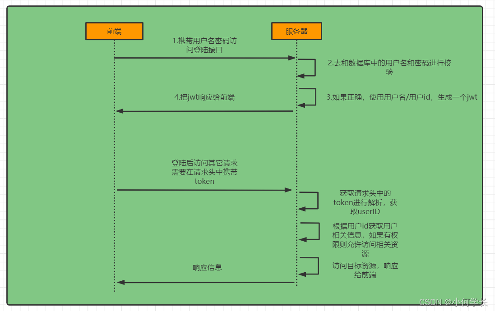
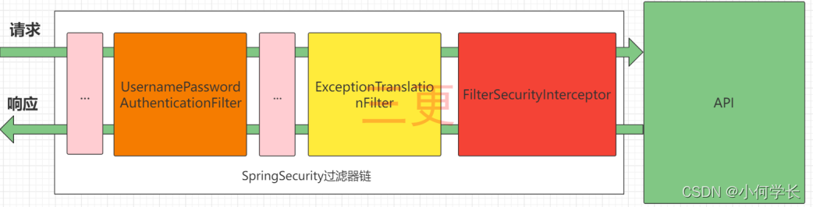
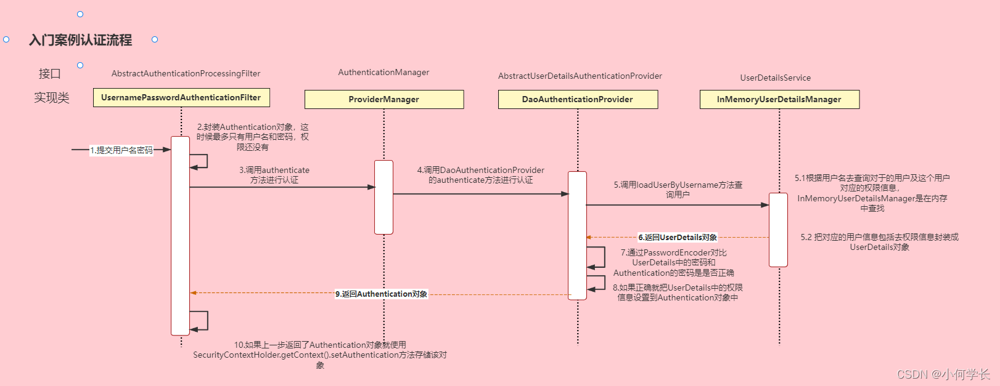
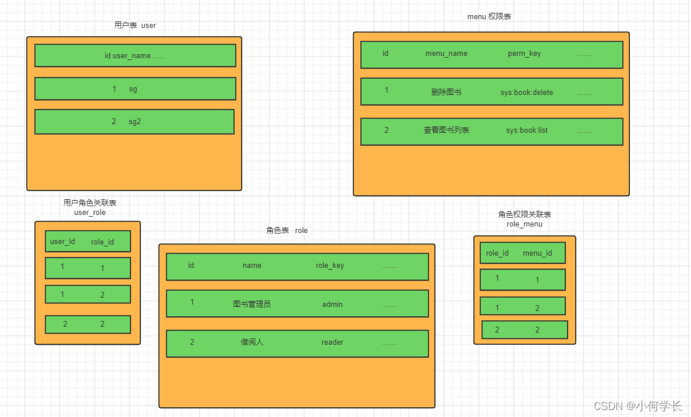

## 1.Spring Security 前后端分离登录校验


## 2.过滤器链

- UsernamePasswordAuthenticationFilter:负责处理我们在登陆页面填写了用户名密码后的登陆请求。入门案例的认证工作主要有它负责。
- ExceptionTranslationFilter： 处理过滤器链中抛出的任何AccessDeniedException和AuthenticationException 。
- FilterSecurityInterceptor： 负责权限校验的过滤器。

## 3.认证流程

- Authentication接口: 它的实现类，表示当前访问系统的用户，封装了用户相关信息。
- AuthenticationManager接口：定义了认证Authentication的方法
- UserDetailsService接口：加载用户特定数据的核心接口。里面定义了一个根据用户名查询用户信息的方法。
- UserDetails接口：提供核心用户信息。通过UserDetailsService根据用户名获取处理的用户信息要封装成UserDetails对象返回。然后将这些信息封装到Authentication对象中。

## 4.思路分析
 4.1 登录
 
①自定义登录接口
- 调用ProviderManager的方法进行认证 如果认证通过生成jwt
- 把用户信息存入redis中

②自定义UserDetailsService
- 在这个实现类中去查询数据库

4.2 校验：

 ①定义Jwt认证过滤器(JwtAuthenticationTokenFilter)
- 获取token
- 解析token获取其中的userid
- 从redis中获取用户信息
- 存入SecurityContextHolder

## 5.授权实现
5.1 限制访问资源所需权限
- 开启相关配置: @EnableGlobalMethodSecurity(prePostEnabled = true)
- 在接口使用对应的注解: @PreAuthorize

5.2 RBAC权限模型: RBAC权限模型（Role-Based Access Control）即：基于角色的权限控制


## 6. 自定义失败处理
-  在认证失败或者是授权失败的情况下也能和我们的接口一样返回相同结构的json，这样可以让前端能对响应进行统一的处理。要实现这个功能我们需要知道SpringSecurity的异常处理机制。
-  在SpringSecurity中，如果我们在认证或者授权的过程中出现了异常会被ExceptionTranslationFilter捕获到。在ExceptionTranslationFilter中会去判断是认证失败还是授权失败出现的异常。
-  如果是认证过程中出现的异常会被封装成AuthenticationException然后调用AuthenticationEntryPoint 对象的方法去进行异常处理。
-  如果是授权过程中出现的异常会被封装成AccessDeniedException然后调用AccessDeniedHandler对象的方法去进行异常处理。
-  所以如果我们需要自定义异常处理，我们只需要自定义AuthenticationEntryPoint和AccessDeniedHandler然后配置给SpringSecurity即可。

6.1 自定义实现类
- public class AccessDeniedHandlerImpl implements AccessDeniedHandler
- public class AuthenticationEntryPointImpl implements AuthenticationEntryPoint

6.1 配置给SpringSecurity
- http.exceptionHandling().authenticationEntryPoint(authenticationEntryPoint).
                accessDeniedHandler(accessDeniedHandler);
  
## 7. 跨域
-  浏览器出于安全的考虑，使用 XMLHttpRequest对象发起 HTTP请求时必须遵守同源策略，否则就是跨域的HTTP请求，默认情况下是被禁止的。 同源策略要求源相同才能正常进行通信，即协议、域名、端口号都完全一致。
 前后端分离项目，前端项目和后端项目一般都不是同源的，所以肯定会存在跨域请求的问题。
 所以我们就要处理一下，让前端能进行跨域请求。
   
7.1 先对SpringBoot配置，运行跨域请求
``` @Configuration
public class CorsConfig implements WebMvcConfigurer {
    @Override
    public void addCorsMappings(CorsRegistry registry) {
      // 设置允许跨域的路径
        registry.addMapping("/**")
                // 设置允许跨域请求的域名
                .allowedOriginPatterns("*")
                // 是否允许cookie
                .allowCredentials(true)
                // 设置允许的请求方式
                .allowedMethods("GET", "POST", "DELETE", "PUT")
                // 设置允许的header属性
                .allowedHeaders("*")
                // 跨域允许时间
                .maxAge(3600);
    }
}
```

7.1 开启SpringSecurity的跨域访问
```
  @Bean
    SecurityFilterChain filterChain(HttpSecurity http) throws Exception {
        return http
                // 基于 token，不需要 csrf 
                .csrf().disable()
                // 基于 token，不需要 session
                .sessionManagement().sessionCreationPolicy(SessionCreationPolicy.STATELESS).and()
                // 配置校验器
                .addFilterBefore(jwtAuthenticationTokenFilter, UsernamePasswordAuthenticationFilter.class)
                // 异常处理
                .exceptionHandling().accessDeniedHandler(accessDeniedHandler).authenticationEntryPoint(authenticationEntryPoint).and()
                // 认证成功、失败处理
                .formLogin().successHandler(authenticationSuccessHandler).failureHandler(authenticationFailureHandler).and()
                // 注销
                .logout().logoutSuccessHandler(logoutSuccessHandler).and()
                //认证成功处理器
                // 设置权限
                .authorizeRequests(authorize -> authorize
                                // 登录接口开启匿名访问
                                .antMatchers("/user/login").anonymous()
//                        // 这里也可以设置接口权限
//                        .antMatchers("/test2").hasAuthority("menu:main")
                                // 其他地址的访问均需验证权限
                                .anyRequest().authenticated()
                )
                .build();
    }
```